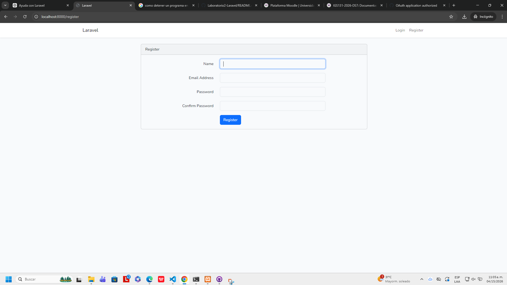

# 🚀 Laboratorio #2 – Login en Laravel


---

## 🏫 Universidad Tecnológica de Panamá

📚 Facultad de Ingeniería de Sistemas Computacionales
👨‍💻 Curso: Desarrollo de Software IIV

---

## 📖 1. Requisitos Previos

Para ejecutar este proyecto se requiere:

* 🐘 PHP 8 o superior
* 📦 Composer
* 🚀 Laravel Installer
* 💻 XAMPP (Apache + MySQL)
* 🗄️ Base de datos MySQL
* 🧑‍💻 Visual Studio Code
* 🟢 Node.js y npm
* 🖥️ Windows

---

## ⚙️ 2. Instalación y Flujo de Comandos

```bash
composer global require laravel/installer
cd C:\xampp\htdocs
laravel new PruebaRegistroLaravel
cd PruebaRegistroLaravel

php artisan migrate

composer require laravel/ui
php artisan ui bootstrap --auth

npm install
npm run dev

php artisan serve
```

---

## 🧠 3. Introducción (MVC)

Este proyecto utiliza la arquitectura **MVC (Modelo - Vista - Controlador)**:

* 📦 **Modelo:** Maneja la base de datos (User)
* 🎨 **Vista:** Interfaz (login, registro)
* 🧠 **Controlador:** Lógica del sistema
* 🌐 **Rutas:** Navegación entre vistas

### 🎯 Objetivo

Implementar un sistema de autenticación funcional usando Laravel.

---

## 🖼️ 4. Resultado del Sistema

✅ Registro de usuarios
✅ Inicio de sesión
✅ Validación de credenciales



---

## 🗄️ 5. Base de Datos

Se utilizó **MySQL** con la siguiente configuración:

```env
DB_CONNECTION=mysql
DB_HOST=127.0.0.1
DB_PORT=3306
DB_DATABASE=prueba_registro
DB_USERNAME=root
DB_PASSWORD=
```

### 🔧 Migraciones

```bash
php artisan migrate
```

✔ Tablas creadas:

* users
* cache
* jobs

---

## ⚠️ 6. Dificultades y Soluciones

### ❌ npm no se reconoce

✔ Se instaló Node.js

---

### ❌ PowerShell bloquea npm

✔ Solución:

```bash
Set-ExecutionPolicy RemoteSigned -Scope CurrentUser
```

---

### ❌ Error en migraciones

✔ Verificar:

* MySQL activo
* Configuración correcta en `.env`

---

## 📚 7. Referencias

* https://laravel.com/docs
* https://getcomposer.org
* https://nodejs.org

---

## 📅 8. Fecha de Ejecución

📌 14 de abril de 2026

---

## 👨‍🎓 9. Información del Estudiante

---

### ✨ Desarrollado por:

👤 **Johanns Garcés**
📧 **Correo:** 8-1000-355
📘 **Curso:** Desarrollo de Software IIV
👩‍🏫 **Instructor:** Irina Fong

---

💡 *Proyecto académico – Universidad Tecnológica de Panamá*
